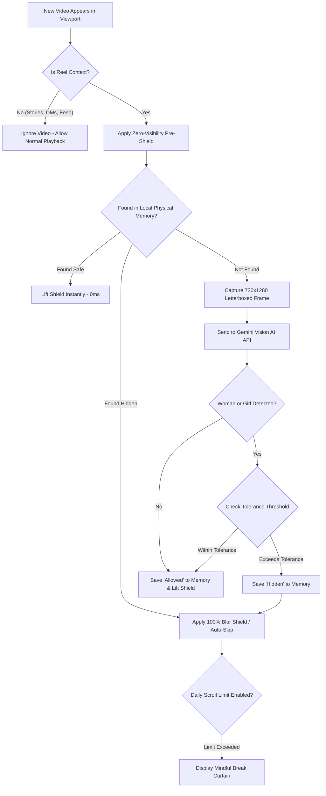

<div align="center">

# 🛡️ Halal Mode — Intelligent AI Video Protection & Mindful Scrolling

[](https://developer.chrome.com/docs/extensions/mv3/intro/)
[](https://aistudio.google.com/)
[](./scripts/test-extension.js)
[](./LICENSE)
[](#-privacy--permissions)

<br/>

**Protect your gaze and reclaim your focus across Instagram Reels, YouTube Shorts, and TikTok.**  
Powered by Google Gemini Multimodal Vision AI with zero-visibility pre-shielding, local reel memory, and mindful scroll limits.

<br/>


</div>

---

## 📸 Visual Showcase

<div align="center">

| Popup Controller | Shield in Feed |
| :---: | :---: |
|  |  |

| Mindful Doomscroll Curtain | Saved Reels Memory Modal |
| :---: | :---: |
|  |  |

</div>

---

## 📖 Overview

Modern short-form video algorithms are engineered to capture and hold attention through hyper-stimulating, provocative content. **Halal Mode** is an open-source, privacy-first browser extension that uses Google's latest multimodal vision models to automatically detect female faces and figures on screen with near-human accuracy, instantly shielding your gaze and keeping your digital experience clean.

Unlike rudimentary on-device face detectors that fail with traditional attire, side angles, motion blur, or dim lighting, **Halal Mode** leverages Gemini Vision AI to recognize complex context, dancers, background figures, and multi-person scenes in **under 200ms**.

---

## ✨ Key Features

### ⚡ 1. Multimodal Gemini Vision AI Engine
- **Human-Level Visual Understanding**: Evaluates video frames using `gemini-3.5-flash-lite` (with automatic fallback to `gemini-flash-latest` and local neural weights).
- **Comprehensive Detection**: Reliably detects women in sarees, abayas, wedding celebrations, fitness clips, side angles, and low-light environments.
- **Blazing Fast**: Typical API roundtrip is between 150ms and 250ms.

### 🛡️ 2. Zero-Visibility Pre-Shielding
- **No Accidental Glances**: When an unverified video scrolls into view, an impenetrable black veil covers the element before the first frame can register in your sight.
- **Instant Unshield**: If Gemini verifies the reel is safe or falls within your custom tolerance threshold, the shield lifts smoothly in ~200ms.
- **Permanent Lock**: If female presence is confirmed, the video is instantly locked behind an impenetrable 80px blur filter and a custom interactive control card.

<div align="center">
  
  <p><em>Impenetrable dark shield with on-screen Unblur Video and Skip to Next Reel controls.</em></p>
</div>

### 🔮 3. Speculative Feed Pre-Scanning
- **Lookahead Intelligence**: Scans upcoming videos pre-loaded into the DOM *before* you scroll to them.
- By the time you reach the next reel, it has already been classified and either cleared for instant playback or pre-shielded and collapsed.

### ⏳ 4. Mindful Daily Doomscroll Limiter
- **Doomscroll Prevention**: Set a daily quota (e.g. 50, 100, 150, 200 reels).
- **Graceful Mindfulness Curtain**: Once your daily limit is reached, active playback is paused and a peaceful reminder overlay encourages you to step away and refocus on real life.
- **Quick Extension**: Includes a gentle +15 reel extension button if you need to finish research or a specific clip.
- **Midnight Auto-Reset**: Counters reset automatically at midnight in your local timezone.

<div align="center">
  
  <p><em>Peaceful break curtain displayed upon reaching daily reel quota.</em></p>
</div>

### 🎚️ 5. Customizable Tolerance & AI Strictness
Adjust the corner and background sensitivity slider from 0% to 100%:
- **0% (Strict Mode)**: Any female presence anywhere on screen (even a distant corner or background passerby) is hidden immediately.
- **1% – 60% (Balanced Mode)**: Allows small background bystanders or tiny corner snippets, but strictly blocks focal subjects.
- **61% – 100% (Permissive Mode)**: Only conceals primary, close-up, or full-screen focal subjects.

### 💾 6. Physical Reel Memory (0ms Latency on Revisits)
- **Zero API Waste**: Every classified reel is saved locally in `chrome.storage.local`.
- When scrolling back up or revisiting a reel, classification latency is **0ms** and consumes **0 API quota**.
- **Interactive Database Manager**: Search, filter, view details, toggle verdicts (Hidden vs Allowed), or export your registry as **CSV** or **JSON**.

<div align="center">
  
  <p><em>Search, filter, toggle verdicts, or export saved reel memory to CSV / JSON.</em></p>
</div>

### ⏭️ 7. Dual Action Modes
- **Blur Mode**: Applies an impenetrable blur shield while keeping audio active. Includes on-screen **"Unblur Video"** and **"Skip to Next Reel"** controls.
- **Auto-Skip Mode**: Blurs the reel immediately and physically collapses it out of the scroll feed, advancing automatically to the next reel.

### ⌨️ 8. Keyboard Hotkeys
- Press **`B`** at any moment on your keyboard to instantly blur the active video and save it to your permanent blocklist.

---

## 🌐 Supported Platforms

Halal Mode is purpose-built for short-form video platforms:

| Platform | Supported Route | Isolation & Safety |
| :--- | :--- | :--- |
| **Instagram** | `/reels/*`, `/reel/*` | ⚠️ **Stories (`/stories/*`) and Direct Messages (`/direct/*`) are strictly excluded** to ensure personal conversations and stories remain uninterrupted. |
| **YouTube** | `/shorts/*` | Standard horizontal videos (`/watch`) are excluded. |
| **TikTok** | Video feed (`/video/*`) | All feed videos. |

---

## 🏗️ Architecture & How It Works



---

## 🚀 Installation & Setup

### Requirements
- Any modern Chromium browser: **Google Chrome**, **Microsoft Edge**, **Brave**, **Opera**, or **Arc**.
- A free **Google Gemini API Key** from [Google AI Studio](https://aistudio.google.com/).

### Installation Steps

1. **Clone or Download the Repository**:
   ```bash
   git clone https://github.com/Lafarie/halal-mode.git
   cd halal-mode
   ```
   *(Or download the ZIP file from GitHub and extract it to a folder).*

2. **Open Extensions in Your Browser**:
   - In Chrome: `chrome://extensions/`
   - In Edge: `edge://extensions/`
   - In Brave: `brave://extensions/`

3. **Enable Developer Mode**:
   - Toggle the **Developer mode** switch in the top-right corner.

4. **Load the Extension**:
   - Click the **Load unpacked** button in the top-left.
   - Select the `halal-mode` folder that contains `manifest.json`.

5. **Pin the Extension**:
   - Click the puzzle icon in your browser toolbar and pin **Halal Mode** for quick access.

---

## 🔑 Obtaining a Free Gemini API Key

1. Visit [Google AI Studio](https://aistudio.google.com/).
2. Sign in with your Google account.
3. Click **Get API key** → **Create API key**.
4. Copy the generated key.
5. Open the **Halal Mode** popup, click the settings gear or AI status card, paste your key, and click **Save Key**.
6. The status pill will turn green: `Gemini Vision AI Engine: Active`.

> 🔒 **Security Notice**: Your API key is stored exclusively in your browser's local encrypted storage (`chrome.storage.local`). It is sent directly to Google's official Gemini endpoint (`https://generativelanguage.googleapis.com/`) over HTTPS. It is never transmitted to any third-party server or developer telemetry.

---

## 🧪 Running Tests

Halal Mode includes a comprehensive automated test suite with **32 unit and integration assertions** verifying Manifest V3 specifications, URL isolation, counter deduplication, anti-flood throttling, and timezone rollover.

Run the test suite via Node.js:

```bash
npm test
```

---

## 🔒 Privacy & Permissions

Halal Mode values user privacy above all else:

| Permission | Purpose |
| :--- | :--- |
| `storage` | Saves your settings, tolerance preference, daily scroll counts, and physical cache locally on your device. |
| `tabs` | Required to query current tab URL and status when opening the popup controls. |
| `declarativeNetRequest` | Used to block ad trackers that inject un-shielded video previews. |
| `host_permissions` | Allows content scripts and frame capture on `instagram.com`, `youtube.com`, and `tiktok.com`. |

- **No Remote Telemetry**: No tracking scripts, analytics, or third-party SDKs.
- **No Account Required**: Works immediately with your own API key.
- **Open Source**: Full codebase is visible and auditable by anyone.

---

## 📄 License

This project is licensed under the **MIT License** — see the [LICENSE](LICENSE) file for details.
