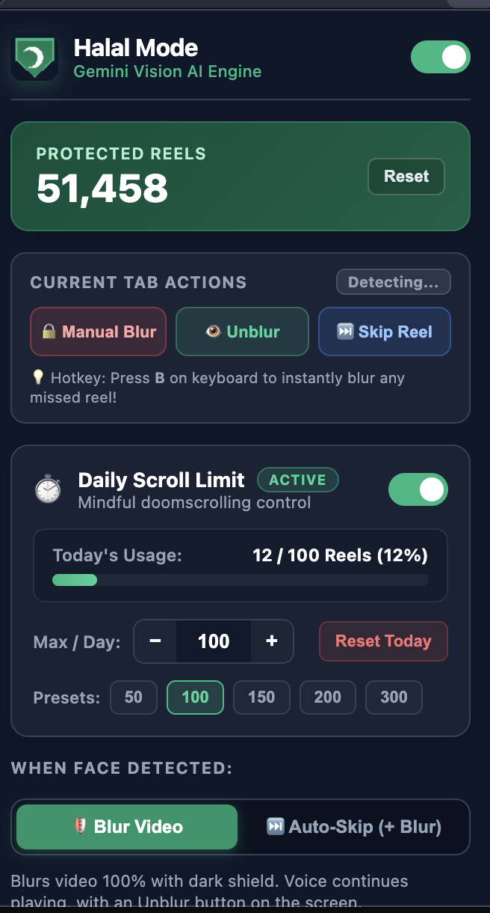
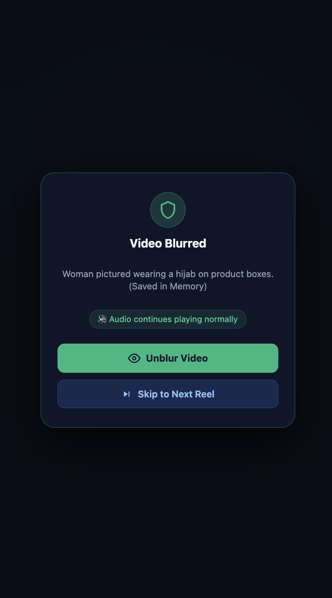
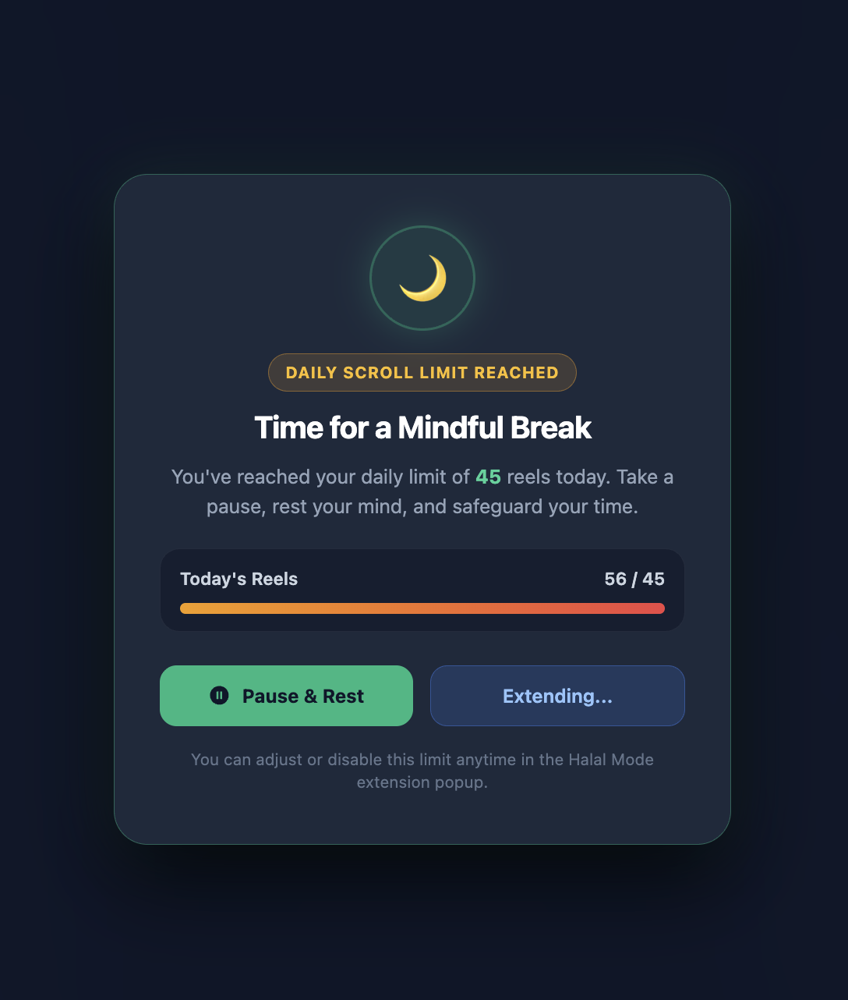
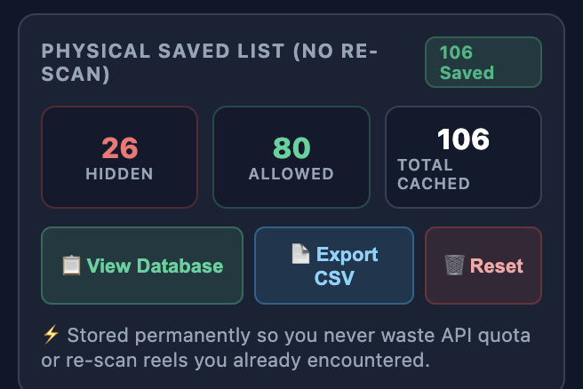
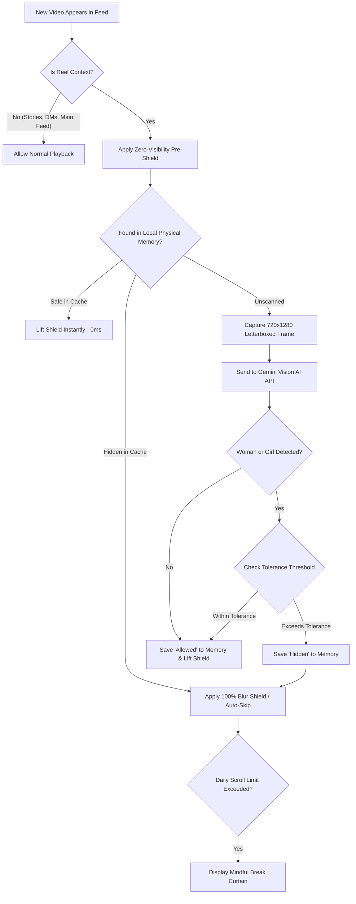

<p align="center">
  <a href="https://github.com/Lafarie/halal-mode">
    
  </a>
</p>

<h1 align="center">🛡️ Halal Mode</h1>

<p align="center">
  <strong>Intelligent AI Video Protection & Mindful Doomscroll Limiter</strong><br>
  <em>Reclaim your focus and protect your gaze across Instagram Reels, YouTube Shorts, and TikTok with cutting-edge Multimodal Vision AI.</em>
</p>

<p align="center">
  <a href="https://developer.chrome.com/docs/extensions/mv3/intro/"></a>
  <a href="https://aistudio.google.com/"></a>
  <a href="./scripts/test-extension.js"></a>
  <a href="./LICENSE"></a>
  <a href="#privacy"></a>
</p>

<p align="center">
  <a href="#showcase">Showcase</a> •
  <a href="#why-halal-mode">Why Halal Mode?</a> •
  <a href="#features">Features</a> •
  <a href="#architecture">Architecture</a> •
  <a href="#quick-start">Quick Start</a> •
  <a href="#privacy">Privacy</a>
</p>

<br>

<p align="center">
  
</p>

---

<a id="showcase"></a>
## 📸 Visual Showcase

<div align="center">

| Popup Controller | Reel Shield in Action |
| :---: | :---: |
|  |  |

| Mindful Doomscroll Curtain | Saved Reels Memory Modal |
| :---: | :---: |
|  |  |

</div>

---

<a id="why-halal-mode"></a>
## 💡 Why Halal Mode?

Short-form video algorithms are engineered to maximize watch time through sensational, hyper-stimulating content. Traditional browser blockers rely on outdated face-landmark heuristics that frequently fail when a person turns their head, wears cultural clothing, or stands in dim lighting.

**Halal Mode** solves this by connecting directly to Google's multimodal **Gemini Vision AI** combined with instant local pre-shielding:

| Feature | Legacy Face Detectors | Halal Mode (Gemini Vision AI) |
| :--- | :---: | :---: |
| **Traditional & Cultural Attire** | ❌ Fails on sarees, abayas, scarves | ✅ **Human-level recognition** |
| **Side Angles & Turning Heads** | ❌ Loses face mesh landmarks | ✅ **Understands full scene context** |
| **Dim / Motion-Blurred Scenes** | ❌ Highly error-prone | ✅ **High-accuracy multimodal AI** |
| **First-Frame Leaks** | ❌ Video flashes before detector runs | ✅ **Zero-Visibility Pre-Shield** |
| **Re-visiting Scanned Reels** | ⚠️ Wasteful duplicate re-scans | ✅ **Instant 0ms Physical Cache** |
| **Doomscroll Protection** | ❌ No scroll awareness | ✅ **Daily Reel Quotas & Break Curtain** |
| **User Privacy** | ⚠️ Often routes via 3rd-party servers | ✅ **100% Direct to Google AI / Local** |

---

<a id="features"></a>
## ✨ Key Features

### ⚡ 1. Multimodal Gemini Vision AI Engine
- **State-of-the-Art Accuracy**: Evaluates frames using `gemini-3.5-flash-lite` with automatic fallback to `gemini-flash-latest` and local neural weights.
- **Contextual Understanding**: Reliably detects women in dance routines, wedding processions, fitness videos, low-light stages, and multi-person scenes.
- **Sub-200ms Latency**: Streamlined base64 capture pipeline ensures evaluations finish before you even notice.

### 🛡️ 2. Zero-Visibility Pre-Shielding
- **Zero Accidental Glances**: An impenetrable dark veil immediately covers incoming unverified reels before the first frame can register in your vision.
- **Smooth Unshield**: If Gemini confirms the reel is safe, the shield lifts seamlessly in ~200ms.
- **Instant Lockdown**: If female presence is detected, the video is securely blurred with an impenetrable 80px filter and on-screen controls.

<p align="center">
  <br>
  <em>Impenetrable blur shield with on-screen Unblur Video and Skip to Next Reel controls.</em>
</p>

### ⏳ 3. Mindful Daily Doomscroll Limiter
- **Take Back Your Time**: Set a daily budget (e.g. 50, 100, 150, 200 reels).
- **Graceful Break Curtain**: When your daily quota is reached, active playback is paused and a peaceful reminder overlay invites you to disconnect.
- **Gentle Extension**: Includes a +15 reel extension button if you need to finish research or save a recipe.
- **Automatic Midnight Rollover**: Counters automatically reset each morning according to your local calendar date.

<p align="center">
  <br>
  <em>Peaceful reminder curtain displayed upon reaching your daily scroll limit.</em>
</p>

### 💾 4. Physical Reel Memory (0ms Latency on Revisits)
- **Zero API Quota Waste**: Every classified reel ID is permanently saved to your browser's local database (`chrome.storage.local`).
- **Instant Playback**: Scrolling back up or revisiting saved reels takes **0ms** and consumes **0 API tokens**.
- **Interactive Registry Manager**: Search, filter by verdict, view confidence scores, or export your saved list to **CSV** or **JSON**.

<p align="center">
  <br>
  <em>Search, filter, toggle verdicts, or export saved reel memory to CSV or JSON.</em>
</p>

### 🎚️ 5. AI Strictness & Corner Tolerance Slider
Customize the sensitivity slider from 0% to 100%:
- **0% (Strict)**: Conceals any female presence anywhere on screen, including tiny corner graphics or distant background passersby.
- **1% – 60% (Balanced)**: Permits subtle background figures, but strictly blocks focal or centered subjects.
- **61% – 100% (Permissive)**: Blocks only primary, close-up, or full-screen focal subjects.

### ⏭️ 6. Dual Action Modes
- **Blur Mode**: Blurs the video 100% while keeping audio active. Unblur and Skip buttons appear directly on the video card.
- **Auto-Skip Mode**: Instantly blurs and physically collapses the card out of the feed, auto-advancing to the next reel.

### ⌨️ 7. Instant Keyboard Shortcut
- Press **`B`** at any moment while watching to instantly blur the current reel and add it to your permanent memory blocklist.

---

## 🌐 Supported Platforms

Halal Mode is engineered specifically for vertical short-form video feeds:

| Platform | Supported Route | Scope & Isolation |
| :--- | :--- | :--- |
| **Instagram** | `/reels/*`, `/reel/*` | ⚠️ **Stories (`/stories/*`) and Direct Messages (`/direct/*`) are strictly excluded** so personal chats and stories play uninterrupted. |
| **YouTube** | `/shorts/*` | Standard landscape videos (`/watch`) are ignored. |
| **TikTok** | Video feed (`/video/*`) | All feed videos. |

---

<a id="architecture"></a>
## 🏗️ How It Works



---

<a id="quick-start"></a>
## 🚀 Installation & Setup

### Requirements
- Any modern Chromium browser: **Google Chrome**, **Microsoft Edge**, **Brave**, **Opera**, or **Arc**.
- A free **Google Gemini API Key** from [Google AI Studio](https://aistudio.google.com/).

### Quick Start

1. **Clone or Download the Repository**:
   ```bash
   git clone https://github.com/Lafarie/halal-mode.git
   cd halal-mode
   ```
   *(Or download the ZIP from GitHub and extract it).*

2. **Open Extensions in Your Browser**:
   - Chrome: `chrome://extensions/`
   - Edge: `edge://extensions/`
   - Brave: `brave://extensions/`

3. **Enable Developer Mode**:
   - Toggle the **Developer mode** switch in the top-right corner.

4. **Load the Extension**:
   - Click **Load unpacked** in the top-left corner.
   - Select the `halal-mode` directory containing `manifest.json`.

5. **Pin Halal Mode**:
   - Click the extension puzzle icon in your browser toolbar and pin **Halal Mode**.

---

## 🔑 Obtaining Your Free Gemini API Key

1. Go to [Google AI Studio](https://aistudio.google.com/).
2. Sign in with any Google account.
3. Click **Get API key** → **Create API key**.
4. Copy your key.
5. Click the **Halal Mode** extension icon, paste your key into the **AI Token** field, and click **Save Key**.
6. The status pill will turn green: `Gemini Vision AI Engine: Active`.

> 🔒 **Security Promise**: Your API key is stored exclusively in your browser's private local storage (`chrome.storage.local`). It communicates directly with Google's official Gemini endpoint (`https://generativelanguage.googleapis.com/`) over HTTPS. It is never routed through any intermediary server.

---

## 🧪 Automated Testing

Halal Mode includes a test suite with **32 unit and integration assertions** covering Manifest V3 compliance, URL isolation, anti-flood throttling, and timezone rollover.

Run tests anytime with:

```bash
npm test
```

---

<a id="privacy"></a>
## 🔒 Privacy & Permissions

| Permission | Reason |
| :--- | :--- |
| `storage` | Stores your settings, daily limit counts, and physical cache locally on your machine. |
| `tabs` | Used to inspect active tab status when opening the popup controller. |
| `declarativeNetRequest` | Blocks ad trackers that attempt to inject un-shielded video previews. |
| `host_permissions` | Allows content scripts and frame capture on `instagram.com`, `youtube.com`, and `tiktok.com`. |

- **Zero Tracking**: No Google Analytics, telemetry scripts, or fingerprinting.
- **Zero Middlemen**: 100% direct connection between your browser and Google AI.
- **Fully Auditable**: Clean, un-obfuscated open-source codebase.

---

## 📄 License

Distributed under the **MIT License**. See [`LICENSE`](./LICENSE) for details.
